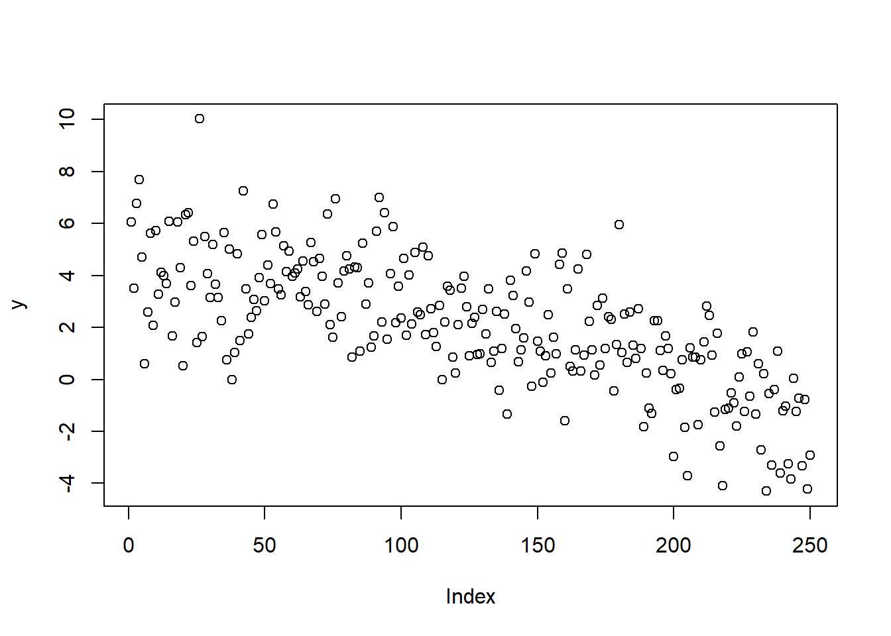
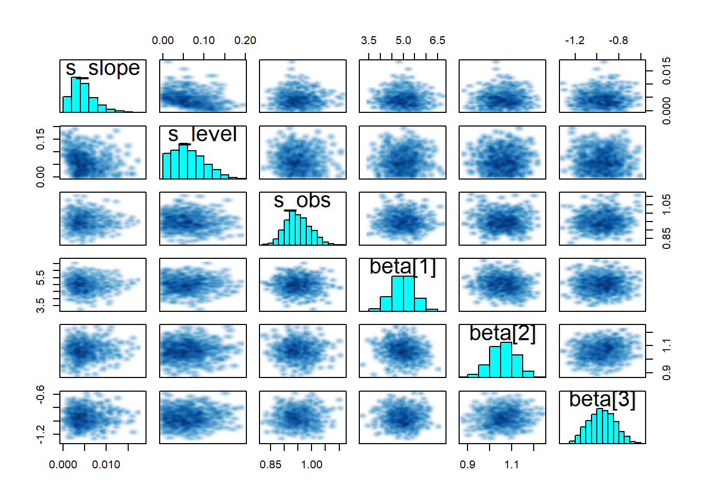
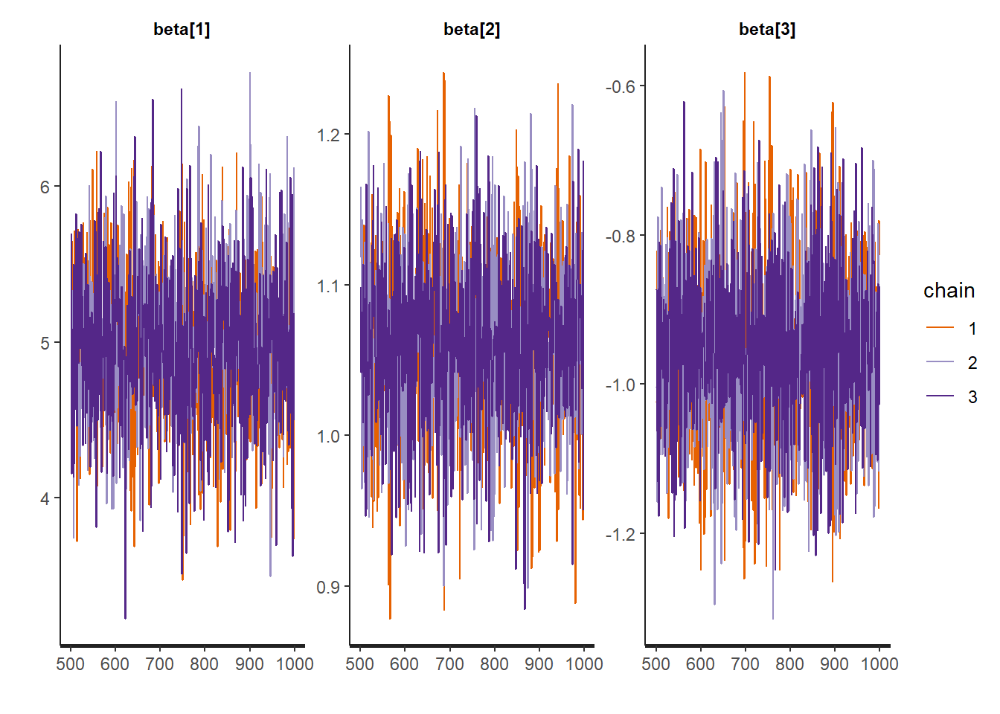
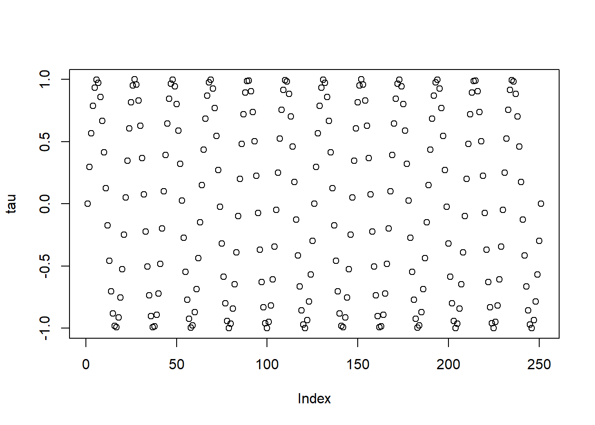
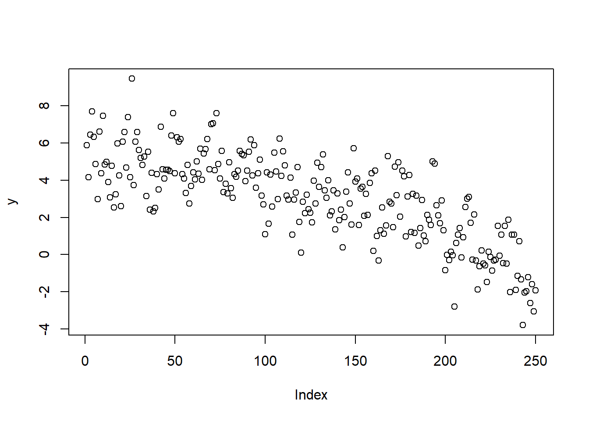

This post is inspired by these two posts, [Fitting Bayesian structural time series with the bsts R package](http://www.unofficialgoogledatascience.com/2017/07/fitting-bayesian-structural-time-series.html) and a subsequent post on the Stan help page [here](https://discourse.mc-stan.org/t/bayesian-structural-time-series-modeling/2256).


```r
library('rstan')
```

```
## Warning: package 'rstan' was built under R version 3.6.1
```

```
## Loading required package: StanHeaders
```

```
## Loading required package: ggplot2
```

```
## rstan (Version 2.19.2, GitRev: 2e1f913d3ca3)
```

```
## For execution on a local, multicore CPU with excess RAM we recommend calling
## options(mc.cores = parallel::detectCores()).
## To avoid recompilation of unchanged Stan programs, we recommend calling
## rstan_options(auto_write = TRUE)
```

```
## For improved execution time, we recommend calling
## Sys.setenv(LOCAL_CPPFLAGS = '-march=native')
## although this causes Stan to throw an error on a few processors.
```

```r
rstan_options(auto_write = TRUE)
options(mc.cores = parallel::detectCores())
library(dplyr)
```

```
## Warning: package 'dplyr' was built under R version 3.6.1
```

```
## 
## Attaching package: 'dplyr'
```

```
## The following objects are masked from 'package:stats':
## 
##     filter, lag
```

```
## The following objects are masked from 'package:base':
## 
##     intersect, setdiff, setequal, union
```


## Data Generating Process

Regression State
$$y_t = \mu_t + \beta^Tx_t + \epsilon_t$$

Trend State

$$\mu_{t+1}=\mu_t+\delta_t+\eta_{0t}$$


```r
set.seed(336)
x1 <- rnorm(250,1,0.1)
x2 <- rnorm(250, 0, 1)
x3 <- rnorm(250, 1, .5)

preds <- data.frame(x1 = x1, x2 = x2, x3 = x3)
v <- rep(-0.0001,250)
u <- rep(0.0,250)
s_slope <- rnorm(250,0,0.005)
s_level <- rnorm(250,0,0.005)
for (i in 2:250){
  u[i] <- u[i-1] + v[i-1] + s_level[i-1]
  v[i] <- v[i-1] + s_slope[i-1]
}

s_obs <- rnorm(250,0,1)
x <- runif(250,0,1)
y <- u + 5*x1 + 1*x2 + -.75*x3+ s_obs
n <- 250
x <- as.matrix(preds)
k <- ncol(preds)
ytrain <- y[1:n]
xtrain <- x[1:n,]

plot(y)
```



## Stan

Develop the Stan model


```r
writeLines(readLines("stan_bsts.stan"))
```

```
// From https://discourse.mc-stan.org/t/bayesian-structural-time-series-modeling/2256

data {
  int <lower=0> t; // number of observations
  int <lower=1> K; // number of predictors 
  matrix[t, K] x; // predictors
  vector[t] y; // outcomes
}

parameters {
  vector[t] u_err; //Slope innovation
  vector[t] v_err; //Level innovation
  vector[K] beta;
  real <lower=0> s_obs;
  real <lower=0> s_slope;
  real <lower=0> s_level;
}

transformed parameters {
  vector[t] u; //Level
  vector[t] v; //Slope
  u[1] = u_err[1];
  v[1] = v_err[1];
  for (i in 2:t) {
    u[i] = u[i-1] + v[i-1] + s_level * u_err[i];
    v[i] = v[i-1] + s_slope * v_err[i];
  }
}

model {
  u_err ~ normal(0,1);
  v_err ~ normal(0,1);
  
  y ~ normal (x*beta + u, s_obs); //u
}
```


```r
stan_dat = list( t = length(ytrain), 
                 y = ytrain, 
                 x = xtrain,
                 K = k)
```

Compile the Stan model.


```r
model_bsts <- stan_model("stan_bsts.stan")
```

The run the model with our data.


```r
#Load stan model file, and fit to data
fit <- sampling(model_bsts , stan_dat,
                iter=1000, 
                chains=3, 
                control = list(max_treedepth = 15,
                               adapt_delta = .95), refresh =0)
```

```
## Warning: There were 1 divergent transitions after warmup. Increasing adapt_delta above 0.95 may help. See
## http://mc-stan.org/misc/warnings.html#divergent-transitions-after-warmup
```

```
## Warning: Examine the pairs() plot to diagnose sampling problems
```

## Model Checking

And as always special thanks to [Michael Betancourt](https://betanalpha.github.io/) for these amazing tools for diagnostics. 


```r
util <- new.env()
source('stan_utilities.R', local=util)
```


```r
util$check_all_diagnostics(fit)
```

### Do pairs plot of different parameters


```r
pairs(fit,pars = c("s_slope","s_level","s_obs","beta"))
```




```r
traceplot(fit, pars = "beta")
```




## Inference


```r
print(fit, pars = "beta")
```

```
## Inference for Stan model: stan_bsts.
## 3 chains, each with iter=1000; warmup=500; thin=1; 
## post-warmup draws per chain=500, total post-warmup draws=1500.
## 
##          mean se_mean   sd  2.5%   25%   50%   75% 97.5% n_eff Rhat
## beta[1]  4.99    0.01 0.52  3.94  4.64  4.98  5.34  6.00  1539    1
## beta[2]  1.06    0.00 0.06  0.94  1.02  1.06  1.10  1.18  3098    1
## beta[3] -0.95    0.00 0.12 -1.18 -1.04 -0.95 -0.87 -0.71  3565    1
## 
## Samples were drawn using NUTS(diag_e) at Tue Jul 16 08:30:05 2019.
## For each parameter, n_eff is a crude measure of effective sample size,
## and Rhat is the potential scale reduction factor on split chains (at 
## convergence, Rhat=1).
```

## Add Seasonality?

### Data Generating Process

Regression State
$$y_t = \mu_t + \tau_t + \beta^Tx_t + \epsilon_t$$

Trend State

$$\mu_{t+1}=\mu_t+\delta_t+\eta_{0t}$$

Seasonal Pattern

$$\tau_{t+1}=-\Sigma_{s=1}^{s-1}\tau_t+\eta_{2t}$$

## Generate Fake Data


```r
set.seed(336)
x1 <- rnorm(250,1,0.1)
x2 <- rnorm(250, 1, .1)
x3 <- rnorm(250, 1, .5)

preds <- data.frame(x1 = x1, x2 = x2, x3 = x3)
v <- rep(-0.0001,250)
u <- rep(0.0,250)
s_slope <- rnorm(250,0,0.005)
s_level <- rnorm(250,0,0.005)

for (i in 2:250){
  u[i] <- u[i-1] + v[i-1] + s_level[i-1]
  v[i] <- v[i-1] + s_slope[i-1]
}

# Seasonal Component with freq = 12
t <- seq(0,1, by = 1/250)

tau <-vector()

tau<- 1*sin(12*pi*t*2)

plot(tau)
```



```r
s_obs <- rnorm(250,0,1)
x <- runif(250,0,1)
y <- u + 5*x1 + 1*x2 + -.75*x3+ s_obs + tau[-251]
n <- 250
x <- as.matrix(preds)
k <- ncol(preds)
ytrain <- y[1:n]
xtrain <- x[1:n,]

plot(y)
```



## Stan Model


```r
writeLines(readLines("stan_bsts_seasonal.stan"))
```

```
// From https://discourse.mc-stan.org/t/bayesian-structural-time-series-modeling/2256

data {
  int <lower=0> t; // number of observations
  int <lower=1> K; // number of predictors 
  matrix[t, K] x; // predictors
  vector[t] y; // outcomes
  int <lower=1> frequency; // seasonality
}

parameters {
  vector[t] u_err; //Slope innovation
  vector[t] v_err; //Level innovation
  vector[t] seasonal; // seasonality
  vector[K] beta;
  real <lower=0> s_obs;
  real <lower=0> s_slope;
  real <lower=0> s_level;
  real <lower=0> s_season;
}

transformed parameters {
  vector[t] u; //Level
  vector[t] v; //Slope
  u[1] = u_err[1];
  v[1] = v_err[1];
  for (i in 2:t) {
    u[i] = u[i-1] + v[i-1] + s_level * u_err[i];
    v[i] = v[i-1] + s_slope * v_err[i];
  }
  
}

model {
  u_err ~ normal(0,1);
  v_err ~ normal(0,1);
  
  // Seasonal Component
  for (i in frequency:t) {
        seasonal[i] ~ normal(- sum(seasonal[i-(frequency-1):i-1]), s_season);
    }
  
  y ~ normal (x*beta + u + seasonal, s_obs); // model
}
```

Now let's compule the model:


```r
model_season <- stan_model("stan_bsts_seasonal.stan")
```

Prepare the data  for Stan.


```r
stan_dat_seasonal = list( t = length(ytrain), 
                 y = ytrain, 
                 x = xtrain,
                 K = k,
                 frequency = 12)
```

Then fit the model.


